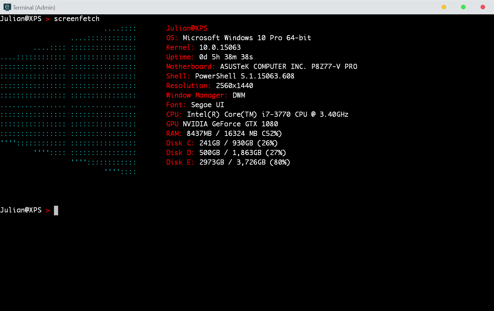

# Windows screenFetch



#### ScreenFetch <hr>

screenFetch was originally made as a "Bash Screenshot Information Tool". Simply, it lets you display detailed information about your system in the terminal, it also comes with a ASCII logo for the detected Linux distribution.

This doesn't work on Windows natively and this project is my attempt to provide a solution that does not require obtaining a linux environment on windows.

<a href="https://github.com/KittyKatt/screenFetch"> The original can be found in KittyKatt's repository.</a>

#### How is it different? <hr>
The original screenfetch requires a system that supports bash so it cannot be used on windows natively! This is a small scale project that simply "mimics" the behaviour of screenFetch in windows. 

**Windows screenFetch is a Powershell script, not a Bash program**. Therefore, a linux-like environment such as <a href="https://www.cygwin.com/"> Cygwin</a> or <a href="http://www.mingw.org/wiki/msys">MinGW</a> is ***not required***. This can be run natively on windows as a Powershell script within a Powershell or command prompt console.

*Since this tool is only intended to run within a windows environment, no flags to invoke any Linux distribution ASCII art is supported.*

#### Installation <hr>

Windows screenFetch is available and managed through <a href="https://www.powershellgallery.com/packages/windows-screenfetch">Powershell Gallery</a>. 

<b>Powershell</b>

    PS> Install-Module -Name windows-screenfetch -RequiredVersion 1.0

Simply run the <code>Screenfetch</code> command after installing the module and you should be good to go


<b>~~Command Prompt~~</b>

No longer supported


#### Usage Parameters <hr>
- The `-distro` argument allows you to specify the ASCII logo shown
- Possible alternatives currently is the apple logo, please see `AsciiArtGenerator` for possible extensions

<br>


#### Troubleshooting <hr>
If you have followed the installation steps but you're getting the following error:

```
The file C:\<yourpath>\screenfetch.ps1 is not digitally signed. 
The script will not execute on the system.
```

A common fix is to run the powershell command `Set-ExecutionPolicy Unrestricted` in a shell with administrative privileges.


#### Contact Me <hr>
Below are my two most active social portals

- `julianchow@outlook.com`
- https://twitter.com/JulianChow94
